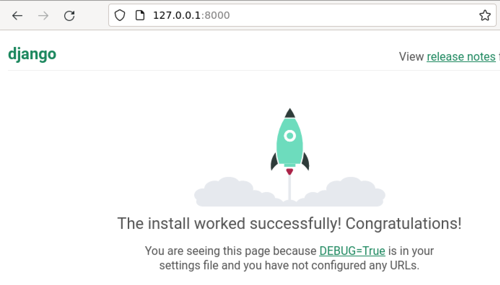
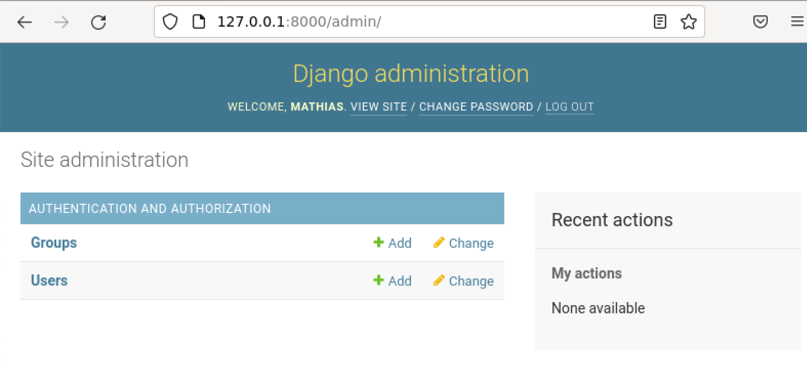
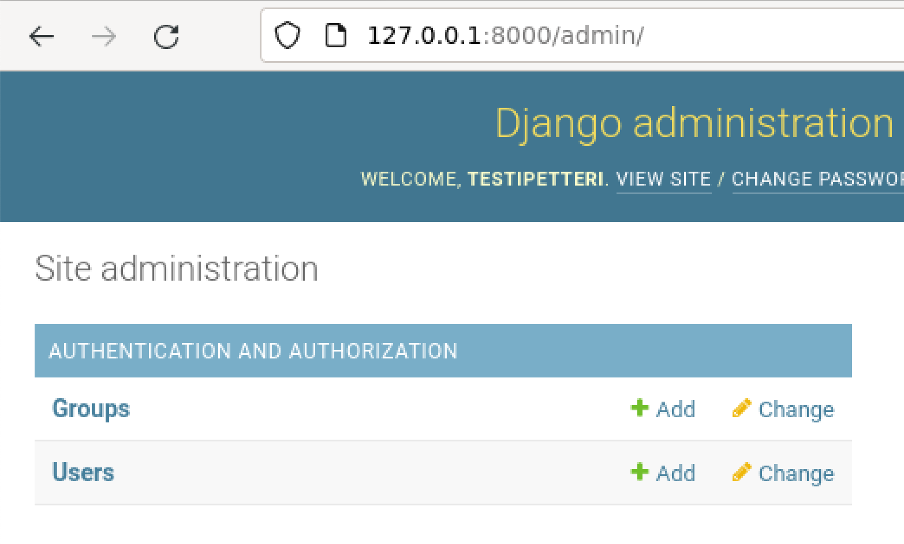
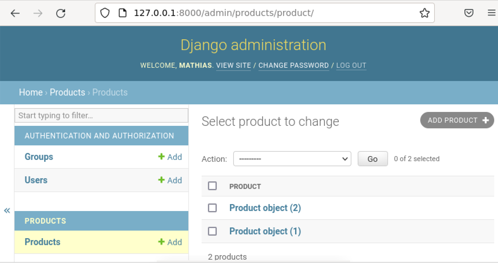
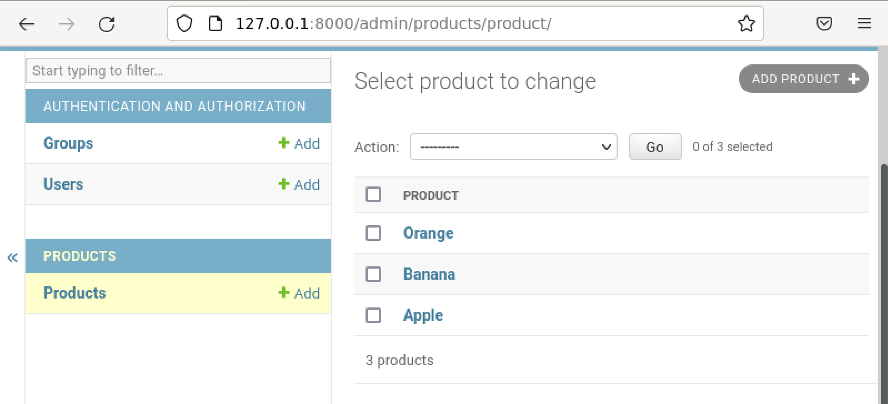

# LinuxPalvelimet-h10-DJAngo

## Mathias Helminen

## Rauta
    Mallin nimi:            MacBook Pro (Retina, 15-inch, Early 2013)
    Prosessorin nimi:       Quad-Core Intel Core i7
    Prosessorin nopeus:     2,7GHz
    Prosessorien määrä:     1
    Ydinten kokonaismäärä:  4
    Muisti (RAM):           16 Gt 1600 MHz DDR3
    Tallennustila:          500 Gt
    Näytönohjain:           Intel HD Graphics 4000
    Järjestelmän versio:    macOS Catalina 10.15.7
    Kernel-versio:          Darwin 19.6.0
    Virtuaalikone:          Oracle VirtualBox, Version 6.1.40
    
# A) Tietokantasovellus
Itsellä ei ollut juuri kokemusta djangosta ennen tätä kurssia, joten siitä syystä seurasin Teron tekemiä ohjeita (https://terokarvinen.com/2022/django-instant-crm-tutorial/) hyvin tarkasti. 

Tehtävän aloitusaika 9:35.

Ensimmäiseksi latasin virtualenv ja uusimmat python versiot. Tässä vaiheessa tein myös ``env/`` -nimisen kansion, jonne paketit ladataan.

    $ sudo apt-get -y install virtualenv
    $ virtualenv --system-site-packages -p python3 env/
    
Seuraavaksi kokeilin käyttää virtuaaliympäristöä.

    $ source env/bin/activate
    

Yllä olevasta kuvasta huomaa, että virtuaaliympäristö toimi oikein ja asennus onnistui, sillä ``(env)`` näkyy promptissa.

Seuraavaksi tein pip -kansion virtuaaliympäristön sisään. 

    $ which pip
    /home/tero/env/bin/pip

Tämän jälkeen latasin Djangon uusimman versio pipin avulla. Ensin kuitenkin listasin Python-paketin tekstitiedostoon.

    $ nano requirements.txt # "django"
    
    $ cat requirements.txt
    django
    
    pip install -r requirements
    

Yllä olevasta kuvasta näkee, että Djangon uusin versio on asennettu (4.1.7).

Seuraavaksi tein projektikansion ja kokeilin toimiiko se. 

    $ django-admin startproject massecom
    
    $ cd massecom
    $ ./manage.py runserver # development server
    

Yllä olevasta kuvasta näkee, että Djangon asennus onnistui.

Seuraavaksi päivitin tietokannan ja tein admin -käyttäjälle oman sivun seuraavilla komennoilla.

    $ ./manage.py makemigrations
    $ ./manage.py migrate

    $ ./manage.py createsuperuser
    

Yllä olevasta kuvasta näkee, että admin -sivu toimii ja pystyin kirjautumaan admin -käyttäjänä sisään.

Seuraavaksi tein uuden käyttäjän nimeltä "testipetteri" ja kokeilin kirjautua hänen tunnuksillaan sisälle. Se onnistui niin kuin alla näkyvästä kuvasta huomaa.

Seuraavaksi tein tuotetietokannan seuraavalla komennolla.

    $ ./manage.py startapp products

Tämän jälkeen muokkasin massecomin asetuksia ja lisäsin sinne kohdan 'products'

    INSTALLED_APPS = [
        'django.contrib.admin',
        'django.contrib.auth',
        'django.contrib.contenttypes',
        'django.contrib.sessions',
        'django.contrib.messages',
        'django.contrib.staticfiles',
        'products', # lisäsin tämän kohdan
    ]

Seuraavaksi lisäsin malleja äsken tehtyyn 'products' tietokantaan.

    $ nano products/models.py
    
    from django.db import models
    
    class Product(models.Model):
        name = models.CharField(max_length=300)
        
Tämän jälkeen ajoin muutokset seuraavilla komennoilla.

    $ ./manage.py makemigrations
    $ ./manage.py migrate

Seuraavaksi rekisteröin uuden tietokannan ``admin/``, jotta se on nähtävissä.

    $ nano products/admin.py
    
    from django.contrib import admin
    from . import models
    admin.site.register(models.Product)

Seuraavaksi kokeilin toimiiko uusi tuotetietokanta. Ajoin seuraavan komennon.

    $ ./manage.py runserver
    

Yllä olevasta kuvasta näkee, että "Products" -niminen kategoria lisättiin onnistuneesti sivulle.

Viimeiseksi muutin tuotteiden nimet näkyviin. Se onnistui seuraavilla komennoilla ja muutoksilla.

    $ nano products/models.py
    
    from django.db import models

    class Product(models.Model):
    name = models.CharField(max_length=160)

    def __str__(self):		# new
        return self.name	# new

Katsotaan onnistuiko nimien muuttaminen oikeiksi tuotenimiksi.

Tuotenimet ovat oikein, joten nimien päivitys onnistui.

Tehtävän lopetusaika 12:27

## Lähteet

https://terokarvinen.com/2023/linux-palvelimet-2023-alkukevat/

https://terokarvinen.com/2022/django-instant-crm-tutorial/
