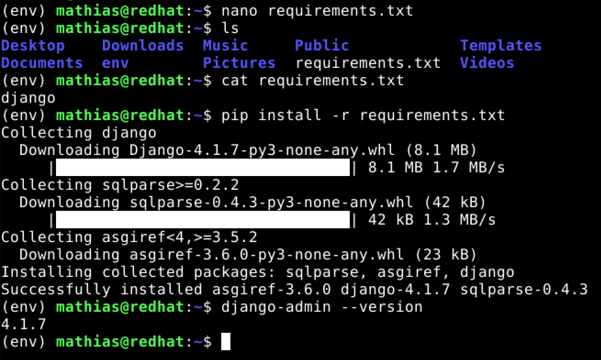

# LinuxPalvelimet-h10-DJAngo

## Mathias Helminen

## Rauta
    Mallin nimi:            MacBook Pro (Retina, 15-inch, Early 2013)
    Prosessorin nimi:       Quad-Core Intel Core i7
    Prosessorin nopeus:     2,7GHz
    Prosessorien määrä:     1
    Ydinten kokonaismäärä:  4
    Muisti (RAM):           16 Gt 1600 MHz DDR3
    Tallennustila:          500 Gt
    Näytönohjain:           Intel HD Graphics 4000
    Järjestelmän versio:    macOS Catalina 10.15.7
    Kernel-versio:          Darwin 19.6.0
    Virtuaalikone:          Oracle VirtualBox, Version 6.1.40
    
# A) Tietokantasovellus
Itsellä ei ollut juuri kokemusta djangosta ennen tätä kurssia, joten siitä syystä seurasin Teron tekemiä ohjeita (https://terokarvinen.com/2022/django-instant-crm-tutorial/) hyvin tarkasti. 

Ensimmäiseksi ladataan virtualenv ja uusimmat python versiot. Tässä vaiheessa tehdään myös ``env/`` -niminen kansio, jonne paketit ladataan. KLO 9:35

    $ sudo apt-get -y install virtualenv
    $ virtualenv --system-site-packages -p python3 env/
    

    
Seuraavaksi kokeillaan käyttää virtuaaliympäristöä.

    $ source env/bin/activate
    

## Lähteet

https://terokarvinen.com/2023/linux-palvelimet-2023-alkukevat/

https://terokarvinen.com/2022/django-instant-crm-tutorial/
