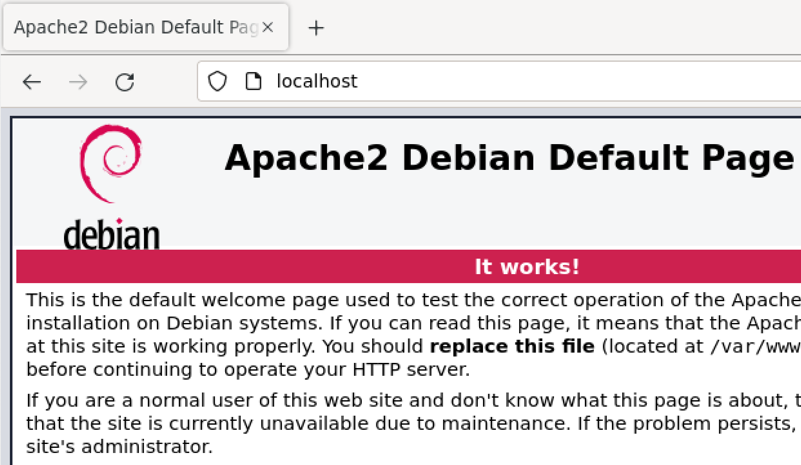
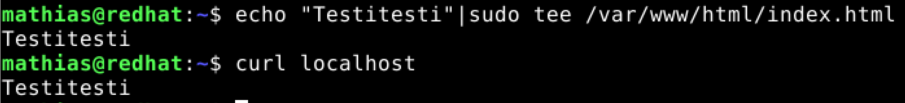
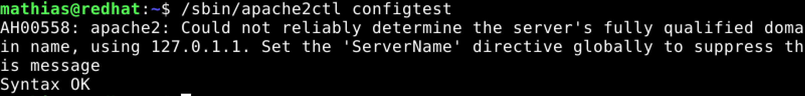
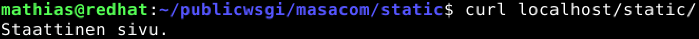
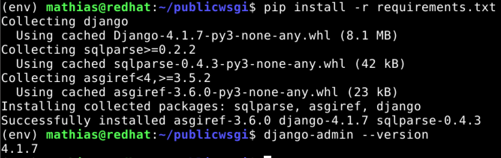
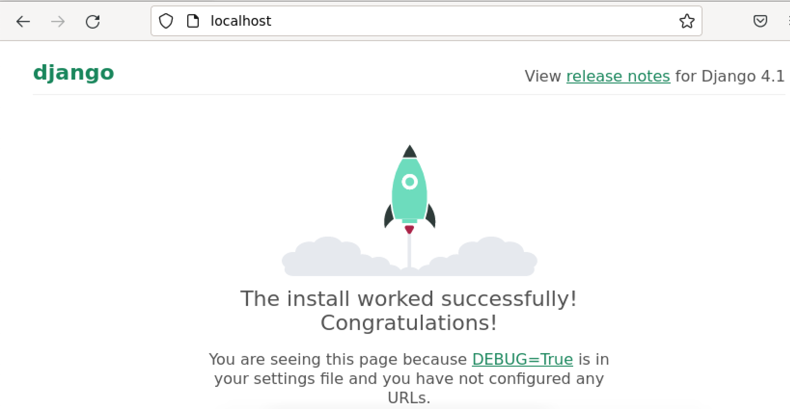
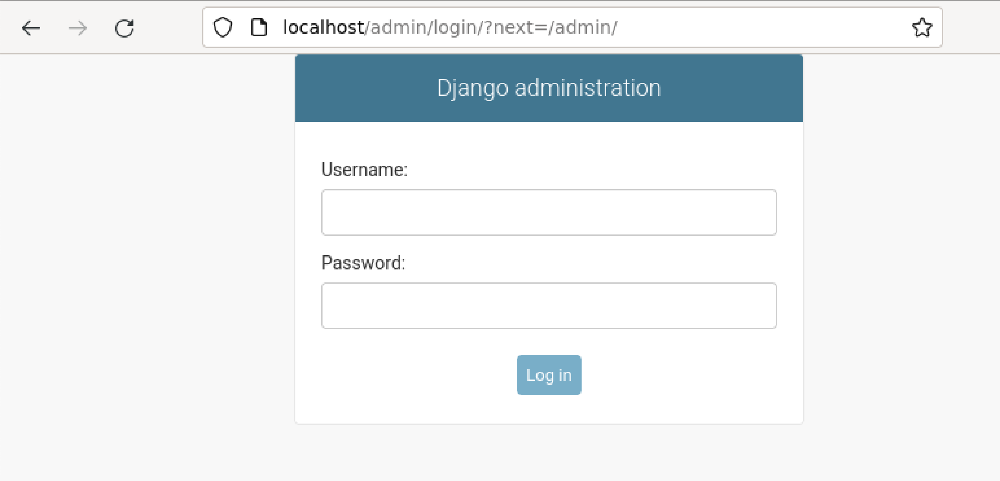

# LinuxPalvelimet-h11-Prod

## Mathias Helminen

## Rauta
    Mallin nimi:            MacBook Pro (Retina, 15-inch, Early 2013)
    Prosessorin nimi:       Quad-Core Intel Core i7
    Prosessorin nopeus:     2,7GHz
    Prosessorien määrä:     1
    Ydinten kokonaismäärä:  4
    Muisti (RAM):           16 Gt 1600 MHz DDR3
    Tallennustila:          500 Gt
    Näytönohjain:           Intel HD Graphics 4000
    Järjestelmän versio:    macOS Catalina 10.15.7
    Kernel-versio:          Darwin 19.6.0
    Virtuaalikone:          Oracle VirtualBox, Version 6.1.40
    
# A) Tuotantoasennus

Tehtävän aloitusaika 14:02.

Aloitin tehtävän asentamalla Apachen virtuaalikoneelle alla näkyvillä komennoilla.

    $ sudo apt-get update
    $ sudo apt-get -y install apache2
    
Alla näkyvästä kuvasta huomaa, että asennus onnistui sillä ``localhost`` -komento selaimessa tuotti toivotun tuloksen.

Tämän jälkeen vaihdoin testisivulle tekstin ``Testitesti``. Se taphtui alla näkyvällä komennolla.

    $ echo "Testitesti"|sudo tee /var/www/html/index.html
    
Tekstin vaihtaminen onnistui, testasin sen ``curl`` komennolla. Alla kuva.

Seuraavaksi lisäsin hakemistopolun ja kansiot ja muutin esimerkkitekstiä alla näkyvillä komennoilla.

    $ mkdir -p publicwsgi/masacom/static/
    $ echo "Staattinen sivu."|tee publicwsgi/teroco/static/index.html
    
Seuraavaksi lisäsin uuden virtuaalihostin (eng. VirtualHost) ja muutin tiedoston sisällön oikeaksi.

    $ sudoedit /etc/apache2/sites-available/teroco.conf
    
    <VirtualHost *:80>
	      Alias /static/ /home/mathias/publicwsgi/masacom/static/
	      <Directory /home/mathias/publicwsgi/masacom/static/>
		        Require all granted
	      </Directory>
    </VirtualHost>

Tämän jälkeen aktivoin uudet asetukset, kytkin vanhat pois päältä ja testasin toimivatko uudet asetukset.

    $ sudo a2ensite teroco.conf
    $ sudo a2dissite 000-default.conf
    $ /sbin/apache2ctl configtest
    
Alla olevasta kuvasta näkee, että Syntax oli oikein (Syntax OK) eli uusien asetusten pitäisi toimia. 

    
Seuraavaksi käynnistin Apachen uudestaan ja testasin toimiiko ``localhost/static/``.

    $ sudo systemctl restart apache2
    $ curl http://localhost/static/
    

``localhost/static/`` näytti sinne kirjoitetun tekstin "Staattinen sivu."
    
Seuraavaksi tein uuden VirtualEnv -ympäristön ``publicwsgi`` -kansion sisälle ja latasin Python 3 -paketit.

    $ virtualenv -p python3 --system-site-packages env
    
Tämän jälkeen aloitin Djangon asentamisen VirtualEnv -ympäristöön. Ensin aktivoin VirtualEnvin, jonka jälkeen varmistin, että ``pip`` oikeassa kansiossa.

    $ source env/bin/activate
    
    $ which pip
    /home/mathias/publicwsgi/env/bin/pip
    
Pip oli oikeassa kansiossa. Seuraaavaksi tein ``requirements.txt`` -tiedoston, jonne kirjoitin sanan "django". Tämä sen takia, että ei tule kirjoitusvirheitä pipillä asentaessa. Tämän jälkeen asensin Djangon pipillä ja testasin, että uusin versio asennettiin.

    $ pip install -r requirements.txt
    
Djangon uusimman version asennus onnistui, kuten alla olevasta kuvasta huomaa.

Olin tämän tehtävän alussa jo tehnyt "masacom" nimisen projektikansion, joten sitä ei tarvinnut enää erikseen tehdä.

Seuraavana yhdistin Pythonin Apacheen. Se onnistui Karvisen ohjeilla hyvin. (https://terokarvinen.com/2022/deploy-django/). Aloitin yhdistämisen muokkaamalla ``masacom.conf`` -tiedostoa ja laitoin sinne oikeat polut seuraavilla komennoilla.

    $ sudoedit /etc/apache2/sites-available/masacom.conf
    
    Define TDIR /home/mathias/publicwsgi/masacom/masacom
    Define TWSGI /home/mathias/publicwsgi/masacom/masacom/masacom/wsgi.py
    Define TUSER mathias
    Define TVENV /home/mathias/publicwsgi/env/lib/python3.9/site-packages

    <VirtualHost *:80>
        Alias /static/ ${TDIR}/static/
        <Directory ${TDIR}/static/>
                Require all granted
        </Directory>

        WSGIDaemonProcess ${TUSER} user=${TUSER} group=${TUSER} threads=5 python-path="${TDIR}:${TVENV}"
        WSGIScriptAlias / ${TWSGI}
        <Directory ${TDIR}>
             WSGIProcessGroup ${TUSER}
             WSGIApplicationGroup %{GLOBAL}
             WSGIScriptReloading On
             <Files wsgi.py>
                Require all granted
             </Files>
        </Directory>

    </VirtualHost>

    Undefine TDIR
    Undefine TWSGI
    Undefine TUSER
    Undefine TVENV

Seuraavaksi asensin Apachen WSGI -moduulin. Tärkeä muistaa asentaa Python 3 -versiot.

    $ sudo apt-get -y install libapache2-mod-wsgi-py3

Tämän jälkeen käynnistin Apachen uudestaan.

    $ sudo systemctl restart apache2
    
Nyt oli aika katsoa selaimessa (Firefox) onnistuiko Apachen lisääminen.

    
Apache on palvelimena ja mod_wsgi toimii.

Seuraavaksi kytkin DEBUGin pois päältä. Se onnistui muokkaamalla ``settings.py`` -tiedostoa.

    $ nano settings.py
    
    DEBUG = False
    ALLOWED_HOSTS = ["localhost"]
    
Tämän jälkeen kosketin ``wsgi.py`` -tiedostoa, käynnistin Apachen uudestaan ja testasin onko DEBUG viesti lähtenyt pois.

    $ touch wsgi.py
    $ sudo systemctl restart apache2
    $ curl -s localhost|grep title
    <title>Not Found</title>
    
Tästä nähdään, että DEBUG mainintaa ei enää tule.

Viimeiseksi lisäsin tyylisivun  ``settings.py`` -tiedostoon seuraavalla komennolla.

    import os
    STATIC_ROOT = os.path.join(BASE_DIR, 'static/')
    
Tämän jälkeen ajoin vielä komennon ``./manage.py collectstatic`` ja nyt tyylisivun pitäisi olla lisätty. Viimeinen testi.

Admin -sivu näyttää siltä miltä sen pitääkin näyttää.

Tehtävän lopetusaika 17:57.
    
## Lähteet

https://terokarvinen.com/2023/linux-palvelimet-2023-alkukevat/

https://terokarvinen.com/2022/deploy-django/
