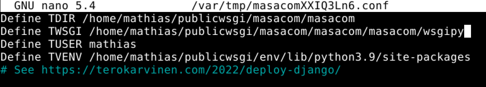
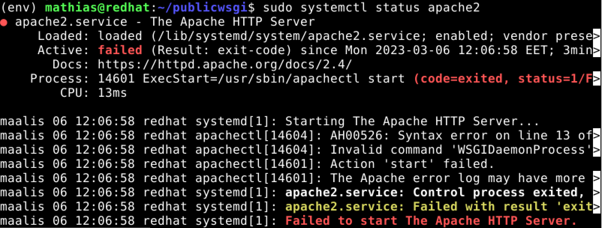

# LinuxPalvelimet-h12-Vianselvitys

## Mathias Helminen

## Rauta
    Mallin nimi:            MacBook Pro (Retina, 15-inch, Early 2013)
    Prosessorin nimi:       Quad-Core Intel Core i7
    Prosessorin nopeus:     2,7GHz
    Prosessorien määrä:     1
    Ydinten kokonaismäärä:  4
    Muisti (RAM):           16 Gt 1600 MHz DDR3
    Tallennustila:          500 Gt
    Näytönohjain:           Intel HD Graphics 4000
    Järjestelmän versio:    macOS Catalina 10.15.7
    Kernel-versio:          Darwin 19.6.0
    Virtuaalikone:          Oracle VirtualBox, Version 6.1.40
    
Tehtävien aloitusaika klo 10:09.

## A) Kirjoitusvirhe Python-tiedostossa

Tässä tehtävässä tein kirjoitusvirheen settings.py tiedostoon. Kokeilin mitä tapahtuu, jos kirjoittaa ALLOWED_HOSTS kohdan väärin.

Testasin selaimessa, että mitä tapahtuu ja selain ilmoitti virheen "Bad Requests (400)". Korjasin kirjoitusvirheen ja käynnistin Apachen uudestaan niin ongelma korjaantui.

## B) Django-projektikansio väärässä paikassa

Vaihdoin Django-projektikansion paikkaa ja testasin mitä ongelmia siitä tuli. Kokeilin selaimessa mitä tapahtuu kun kirjoittaa "localhost" ja sieltä tuli virheilmoitus "Forbidden". Lokista sain esiin ilmoituksen "AH01630: client denied by server configuration". Kaikka palautui normaaliksi kun vaihdoin kansion paikan takaisin ja potkaisin Apachen uudestaan käyntiin.

## C) Projektikansiolla väärät oikeudet

Vaidoin projektikansiolle väärät oikeudet seuraavalla komennolla ``chmod ugo-rwx masacom/``. Kokeilin selaimella, mitä tapahtuu ja sain virheilmoituksen "Forbidden". Tämän jälkeen katsoin löytyykö lokeista mitään. Lokeista tuli ilmoitus "AH00035: access to /admin/login denied because search permissions are missing on a component of the path". Eli oikeudet eivät ole kunnossa. En onnistunut saamaan oikeuksia enää takaisin.

## D) Kirjoitusvirhe Apachen asetustiedostossa

Tässä tehtävässä tein kirjoitusvirheen 'masacom.conf' -tiedostoon. Alla kuva.

Kokeilin selaimessa mitä tapahtuu kun kirjoittaa "localhost" ja sieltä tuli virheilmoitus "Forbidden". Lokista sain esiin ilmoituksen "AH01630: client denied by server configuration". Kaikka palautui normaaliksi kun vaihdoin kirjoitusvirheen pois ja potkaisin Apachen uudestaan käyntiin.

## E) Apachen WSGI-moduuli puuttuu

Aloitin tämän kohdan poistamalla wsgi-moduulin, tein sen seuraavalla komennolla ``sudo apt-get purge libapache2-mod-wsgi-py3``. Tämän jälkeen kokeilin käynnistää apachen uudestaan, mutta se antoi virheilmoituksen "Job for apache2.service failed because the control process exited with error code". Tämän jälkeen ajoin komennon ``sudo systemctl status apache2``, tämä siitä syystä, että saisin enemmän tietoa virheistä. Alla kuva.

Kuvasta voidaan todeta, että apache ei ole käynnissä ja ongelman syy on oletettavasti apache2.service. Tämän jälkeen latasin moduulit uudestaan ja sain apachen toimimaan.

## F) Väärät domain-nimet ALLOWED_HOSTS-kohdassa 

Tässä kohdassa jätin ALLOWED_HOSTS -kohdan tyhjäksi settings.py-tiedostossa. Toimivassa versiossa siellä luki "localhost".

Testasin selaimessa vaikutusta ja vastaukseksi tuli "Bad Request (400)". Korjasin virheen kirjoittamalla ALLOWED_HOSTS kohtaan "localhost" ja potkaisin palvelimen uudestaan käyntiin komennolla ``sudo systemctl restart apache2``.

Tehtävien lopetusaika klo 13:35.

## Lähteet

https://terokarvinen.com/2023/linux-palvelimet-2023-alkukevat/
