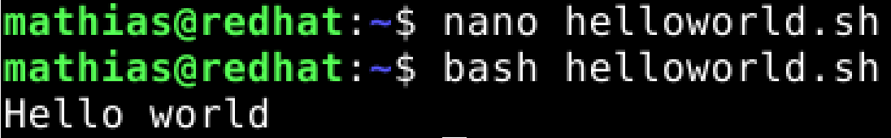

# LinuxPalvelimet-h13-HelloWorld

## Mathias Helminen

## Rauta
    Mallin nimi:            MacBook Pro (Retina, 15-inch, Early 2013)
    Prosessorin nimi:       Quad-Core Intel Core i7
    Prosessorin nopeus:     2,7GHz
    Prosessorien määrä:     1
    Ydinten kokonaismäärä:  4
    Muisti (RAM):           16 Gt 1600 MHz DDR3
    Tallennustila:          500 Gt
    Näytönohjain:           Intel HD Graphics 4000
    Järjestelmän versio:    macOS Catalina 10.15.7
    Kernel-versio:          Darwin 19.6.0
    Virtuaalikone:          Oracle VirtualBox, Version 6.1.40
    
Tehtävien aloitusaika klo 11:24.

## A) "Hei maailma" kolmella eri ohjelmointikielellä

Tässä tehtävässä asensin kolme eri ohjeilmointikieltä Linuxin Debianiin ja testasin, että ne toimivat. Tein asennukset käyttämällä komentorivipäätettä. Asennettavat kielet olivat Python 3, Bash ja Ruby.

### Python 3

Ensimmäiseksi päivitin paketit ja sen jonka jälkeen asensin Python 3 ohjelmointikielen. 

    sudo apt-get update
    sudo apt-get install python3
    

Python 3 olikin jo asennettu. Seuraavaksi tein tiedoston nimeltään "helloworld.py" ja muokkasin tiedostoa niin, että se näyttää tekstin "Hello world", kun se ajetaan Pythonilla. Lopuksi ajoin tiedoston Python 3:lla ja testasin tulostuuko teksti oikein.

    nano helloworld.py
    print("Hello world") # lisäsin tämän koodin tiedoston sisälle
    
    python3 helloworld.py

Kuten yllä näkyvästä kuvasta huomaa, teksti tulostui oikein.

### Bash

Toiseksi ohjelmointikieleksi valitsin Bashin. Asensin Bashin komentorivin kautta.

    sudo apt-get install bash
    

Bash oli myös asennettu valmiiksi. Seuraavaksi tein tiedoston nimeltään "helloworld.sh" ja muokkasin tiedostoa niin, että se näyttää tekstin "Hello world", kun se ajetaan Bashilla. Lopuksi ajoin tiedoston Bashilla ja testasin tulostuuko teksti oikein.

    nano helloworld.sh
    echo "Hello world" # lisäsin tämän koodin tiedoston sisälle
    
    bash helloworld.sh
    

Kuten yllä näkyvästä kuvasta huomaa, teksti tulostui oikein.

### Ruby

Kolmanneksi ohjelmointikieleksi valitsin Rubyn. Asensin sen komentorivin kautta.

    Sudo apt-get install ruby
    

Myös Ruby oli jo asennettu koneelle. Seuraavaksi tein tiedoston nimeltään "helloworld.rb" ja muokkasin tiedostoa niin, että se näyttää tekstin "Hello world", kun se ajetaan Bashilla. Lopuksi ajoin tiedoston Rubylla ja testasin tulostuuko teksti oikein.

    nano helloworld.rb
    print ("Hello world\n") # lisäsin tämän koodin tiedoston sisälle
    
    ruby helloworld.rb
    

Kuten yllä näkyvästä kuvasta huomaa, teksti tulostui oikein.

Tehtävien lopetusaika klo 12:25

## Lähteet

https://terokarvinen.com/2023/linux-palvelimet-2023-alkukevat/

https://terokarvinen.com/2018/hello-python3-bash-c-c-go-lua-ruby-java-programming-languages-on-ubuntu-18-04/
