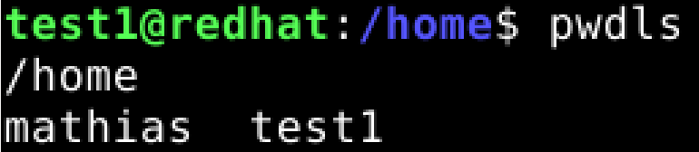
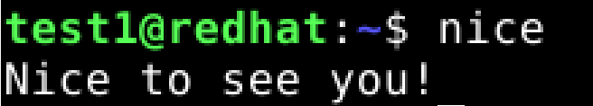
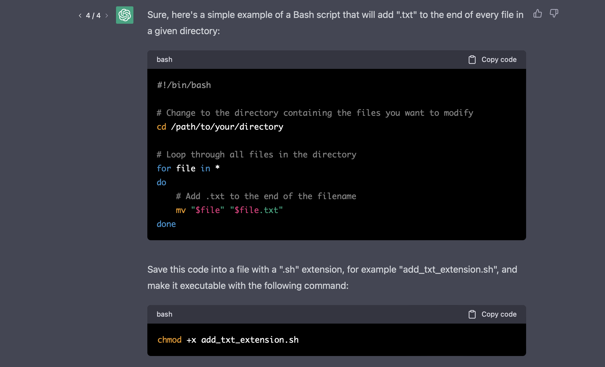
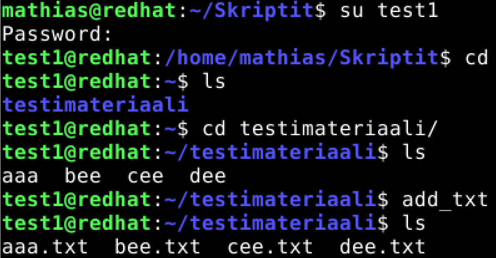

# LinuxPalvelimet-h14-UusiKomento

## Mathias Helminen

## Rauta
    Mallin nimi:            MacBook Pro (Retina, 15-inch, Early 2013)
    Prosessorin nimi:       Quad-Core Intel Core i7
    Prosessorin nopeus:     2,7GHz
    Prosessorien määrä:     1
    Ydinten kokonaismäärä:  4
    Muisti (RAM):           16 Gt 1600 MHz DDR3
    Tallennustila:          500 Gt
    Näytönohjain:           Intel HD Graphics 4000
    Järjestelmän versio:    macOS Catalina 10.15.7
    Kernel-versio:          Darwin 19.6.0
    Virtuaalikone:          Oracle VirtualBox, Version 6.1.40
    
Tehtävien aloitusaika klo 10:24.

## A) Uusi komento Bashilla

Aloitin tehtävän luomalla kansion "Skriptit". Sen sisälle tein tiedoston nimeltään "pwdls". Muokkasin tiedoston sisältöä ja lisäsin sinne Bashia. "Pwd" komento näyttää tiedostopolun ja "ls" listaa tiedostot, jotka ovat sen hetkisessä kansiossa. Kopioin tiedostopolun niin, että kaikilla käyttäjillä on pääsy siihen. Lopuksi annoin kaikille käyttäjille oikeuden ajaa tiedostoa (chmod a+x). 

    $ mkdir Skriptit
    $ cd Skriptit
    $ nano pwdls
    #! /usr/bin/bash
    pwd
    ls
    
    $ sudo cp /home/mathias/Skriptit/pwdls /usr/local/bin
    $ chmod a+x pwdls

Tämän jälkeen vaihdoin käyttäjää ja kokeilin voiko toinen käyttäjä ajaa komennon onnistuneesti.

    $ su test1
    $ pwdls
    

Testi onnistui testikäyttäjällä, joten siitä voi päätellä, että uusi komento toimii niin kuin pitääkin.

## B) Uusi komento Pythonilla

Aloitin tehtävän luomalla tiedoston "nice". Muokkasin tiedoston sisältöä ja lisäsin sinne Python3 -kieltä. Lisätty koodi näyttää tekstin "Nice to see you!" Kopioin tiedostopolun niin, että kaikilla käyttäjillä on pääsy siihen. Lopuksi annoin kaikille käyttäjille oikeuden ajaa tiedostoa (chmod a+x).

    $ nano nice
     #! /usr/bin/bash
     print("Nice to see you!")
     
     $ sudo cp /home/mathias/Skriptit/nice /usr/local/bin
     $ chmod a+x nice
     
Tämän jälkeen vaihdoin käyttäjää ja kokeilin voiko toinen käyttäjä ajaa komennon onnistuneesti.

    $ su test1
    $ nice

Testi onnistui testikäyttäjällä, joten siitä voi päätellä, että uusi komento toimii niin kuin pitääkin.

## C) Uusi komento monelle tiedostolle

Tätä tehtävää en osannut tehdä eikä googlettamallakaan löytynyt tarpeeksi helppoa ratkaisua, joten päätin kysyä ChatGPT:ltä apua. Pyysin ChatGPT:tä tekemään yksinkertaisen Bashiin perustuvan komennon, jossa käytetään useampaa kuin yhtä tiedostoa. Laitan alle kuvan ratkaisusta, jonka ChatGPT antoi.

Kuvassä näkyvä koodi muokkaa kaikkia nykyisessä kansiossa olevia tiedostoja niin, että se lisää ".txt" -tekstin tiedostojen perään. Loop-funktiolla käydään läpi kaikki kansiossa olevat tiedostot. Tässäkin lopuksi lisättiin oikeudet tiedoston ajamiseen. 

Päätin yrittää tehdä täysin samanlaisen komennon. Aloitin luomalla tiedoston "add_txt". Muokkasin tiedoston sisältöä ja lisäsin sinne ChatGPT:stä saadun Bash-koodin. Kopioin tiedostopolun taas niin, että kaikilla käyttäjillä on pääsy siihen. Lopuksi annoin kaikille käyttäjille oikeuden ajaa tiedostoa (chmod a+x).

    $ nano add_txt
    #! /usr/bin/bash
    for file *
    do
        mv "$file" "$file.txt"
    done
     
    $ sudo cp /home/mathias/Skriptit/add_txt /usr/local/bin
    $ chmod a+x add_txt

Tämän jälkeen vaihdoin käyttäjää ja kokeilin voiko toinen käyttäjä ajaa komennon onnistuneesti.

Yllä olevasta kuvasta näkee, että ``add_txt`` -komennon ajaminen lisäsi tiedostojen perään ".txt" -tekstin, joten testi oli onnistunut ja komento toimi.

Tehtävien lopetusaika 13:15.

## Lähteet

https://terokarvinen.com/2023/linux-palvelimet-2023-alkukevat/

https://terokarvinen.com/2007/12/04/shell-scripting-4/?fromSearch=scripting

https://www.hostwinds.com/tutorials/how-to-make-a-script-executable-to-other-users-on-linux

https://chat.openai.com/chat
