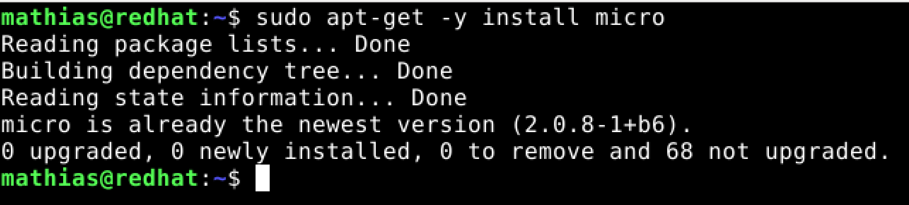
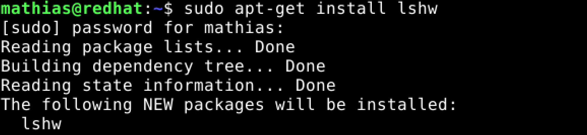
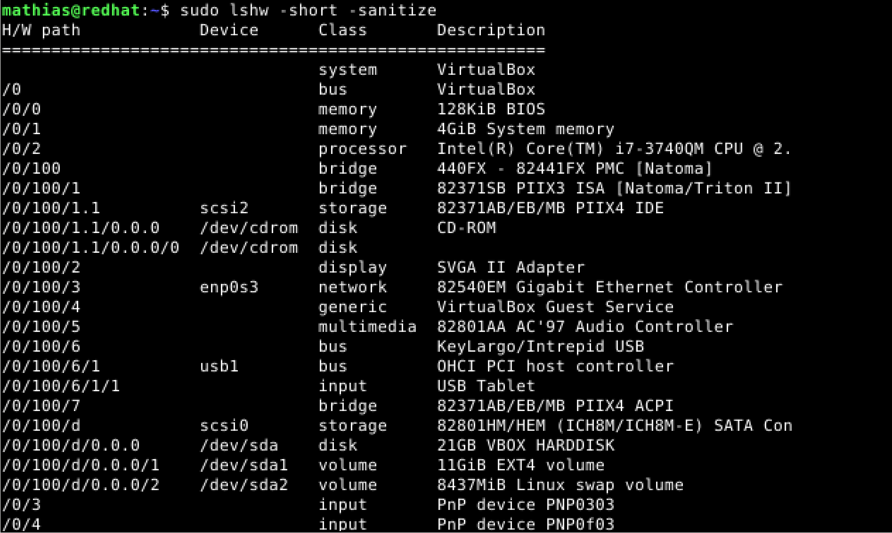
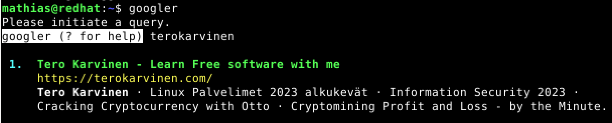
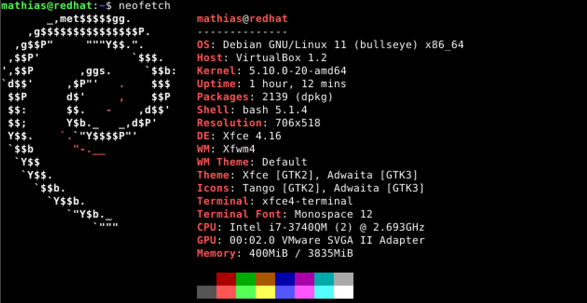
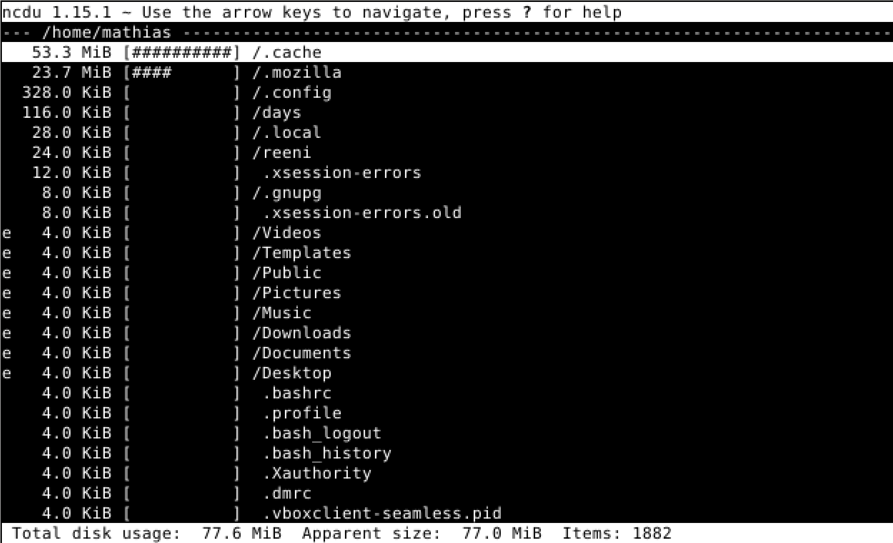

# LinuxPalvelimet-h2-Komentaja-Pingviini

## Micro-editorin asennus
Asensin Micro-editorin Debianin komentorivin kautta seuraavalla komennolla: 'sudo apt-get -y install micro'.

## Lshw:n asennus ja raudan listaus
Minulla ei ollut lshw:ta asennettuna, joten asensin sen virtuaalikoneelleni komentorivin kautta seuraavalla komennolla: 'sudo apt-get install lshw'.

Kun lshw oli asennettu niin listasin käyttämäni raudan komennolla: 'sudo lshw -short -sanitize'.

Komento 'sudo lshw -short -sanitize' listaa tarkat tiedot käyttämästä raudasta. Listaus on kategorisoitu neljään eri osaan: H/W path, device, class ja description. Listalta on helppo lukea tarkat tiedot raudasta jolla työskentelen. Nämä tiedot ovat oleellisia esimerkiksi vianmäärityksessä. 

## Kolmen uuden komentoriviohjelman asennus
Asensin seuraavat kolme komentoriviohjelmaa itselleni: Googler, Neofetch ja ncdu. Kaikki ohjelmat sai ladattua ja asennettua yhdellä komennolla: 'sudo apt-get -y install googler neofetch ncdu'. Seuraavaksi kuvakaappaukset ja lyhyet selitykset ohjelmista.

**Googler** on komentorivityökalu Googlen käyttöön.

Neofetch on komentorivityökalu, joka listaa raudan ja sitä on todella helppo käyttää, sillä se listaa tiedon helposti luettavaan muotoon.

Ncdu on komentorivityökalu, joka listaa raudan muistia käyttävät ohjelmat ja kansiot. 

