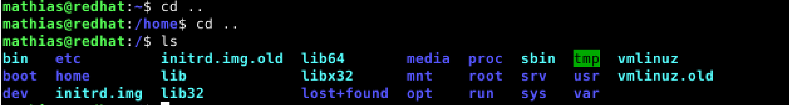
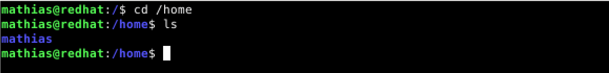
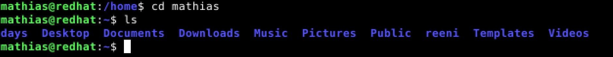
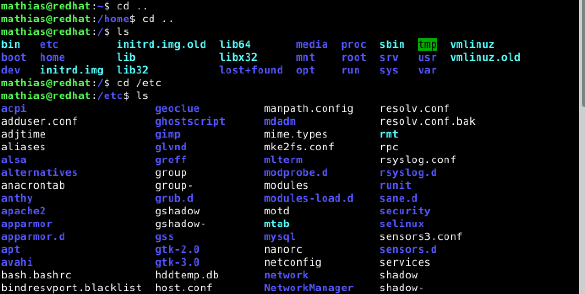
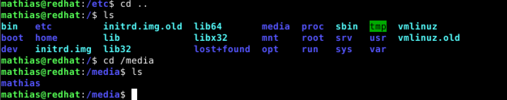
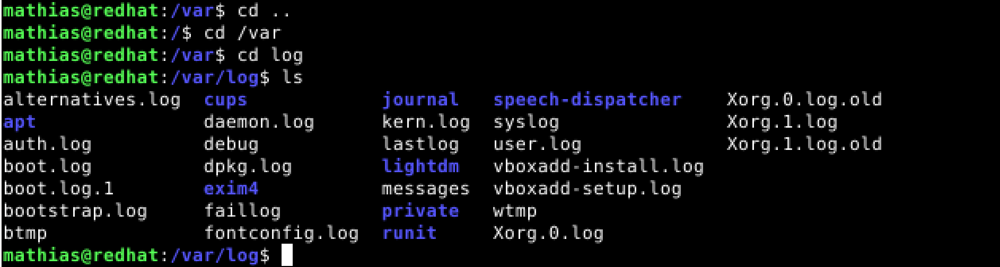
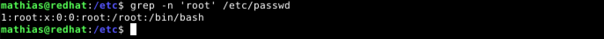
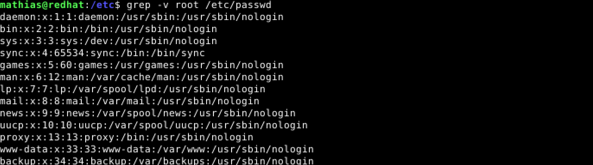

# LinuxPalvelimet-h2-Komentaja-Pingviini

## Micro-editorin asennus
Asensin Micro-editorin Debianin komentorivin kautta seuraavalla komennolla: 'sudo apt-get -y install micro'. KLO: 10.02

## Lshw:n asennus ja raudan listaus
Minulla ei ollut lshw:ta asennettuna, joten asensin sen virtuaalikoneelleni komentorivin kautta seuraavalla komennolla: 'sudo apt-get install lshw'. KLO: 10.15

Kun lshw oli asennettu niin listasin käyttämäni raudan komennolla: 'sudo lshw -short -sanitize'. KLO: 10.25

Komento 'sudo lshw -short -sanitize' listaa tarkat tiedot käyttämästä raudasta. Listaus on kategorisoitu neljään eri osaan: H/W path, device, class ja description. Listalta on helppo lukea tarkat tiedot raudasta jolla työskentelen. Nämä tiedot ovat oleellisia esimerkiksi vianmäärityksessä. KLO: 10.40

## Kolmen uuden komentoriviohjelman asennus
Asensin seuraavat kolme komentoriviohjelmaa itselleni: Googler, Neofetch ja ncdu. Kaikki ohjelmat sai ladattua ja asennettua yhdellä komennolla: 'sudo apt-get -y install googler neofetch ncdu'. Seuraavaksi kuvakaappaukset ja lyhyet selitykset ohjelmista. KLO: 10.55

**Googler** on komentorivityökalu Googlen käyttöön. KLO: 11.04

**Neofetch** on komentorivityökalu, joka listaa raudan ja sitä on todella helppo käyttää, sillä se listaa tiedon helposti luettavaan muotoon. KLO: 11.15

**Ncdu** on komentorivityökalu, joka listaa raudan muistia käyttävät ohjelmat ja kansiot. KLO: 11.22

## Tärkeitä kansioita

### /
Root-kansio, joka on kaikista ylin kansio koko järjestelmässä. KLO: 11.30

### /home/
Sisältää kaikkien käyttäjien koti-kansiot. KLO: 11.35

### /home/mathias/
Käyttäjän "Mathias" koti-kansio. Käyttäjä "Mathias" tallentaa tänne kaiken lataamansa datan. KLO: 11.41

### /etc/
Tästä kansiosta löytyy kaikki järjestelmän asetukset helposti luettavassa teksti tekstimuodossa. KLO: 11.48

### /media/
Tästä kansiosta löytyy ns. irrotettavat mediat kuten usb-tikut ja cd-levyt. KLO: 11.55

### /var/log/
Tästä kansiosta löytyy kaikki järjestelmän lokitiedostot esim. 'syslog'. KLO: 12.05

## Grep-komennon käyttö
Grepin avulla voit etsiä tekstiä tiedostoista. Listaan seuraavassa kolme esimerkkiä Grepin käytöstä.

Tässä etsin sanaa "mathias" kohteesta /etc/passwd Grepin avulla.

Seuraavassa kohdassa käytin lippua '-n'. Se listaa tekstistä löydetyt sanat löytämisjärjestyksessä.

Viimeisessä esimerkissä käytin lippua '-v' ja sanaa 'root'. Tässä yhteydessä Grep etsii tiedostosta kaiken muun paitsi sanan 'root'.

## Lähteet
https://terokarvinen.com/2020/command-line-basics-revisited/?fromSearch=command%20line%20basics%20revisited
https://terokarvinen.com/2023/linux-palvelimet-2023-alkukevat/
https://www.omgubuntu.co.uk/2021/11/best-command-line-tools-ubuntu-linux
https://www.networkworld.com/article/3583598/how-to-view-information-on-your-linux-devices-with-lshw.html
https://www.cyberciti.biz/faq/howto-use-grep-command-in-linux-unix/
