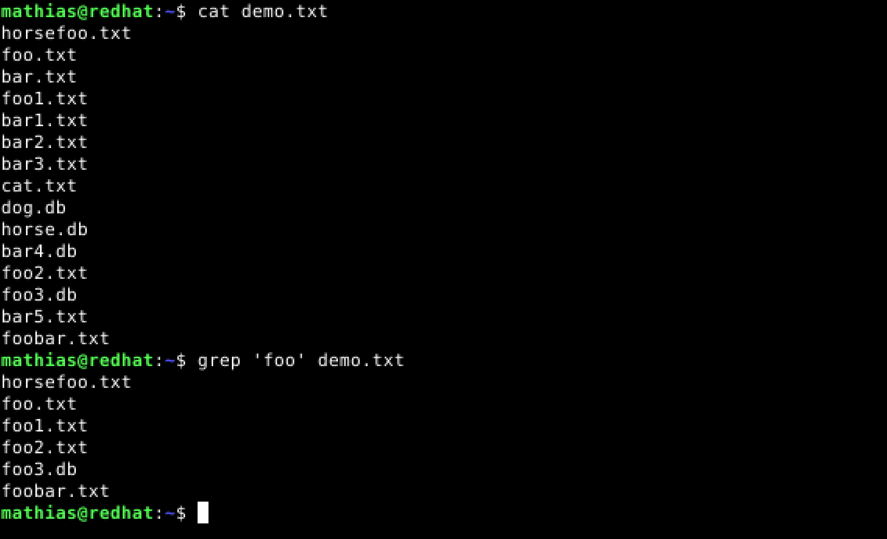
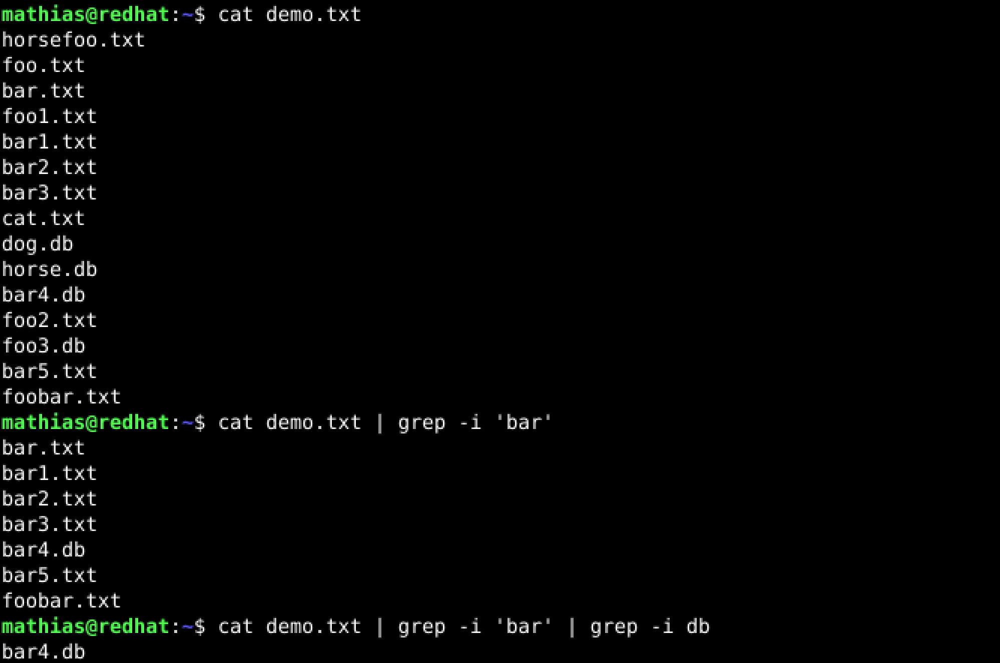

# LinuxPalvelimet-h3-Vapaus!

## Mathias Helminen

## Rauta
    Mallin nimi:            MacBook Pro (Retina, 15-inch, Early 2013)
    Prosessorin nimi:       Quad-Core Intel Core i7
    Prosessorin nopeus:     2,7GHz
    Prosessorien määrä:     1
    Ydinten kokonaismäärä:  4
    Muisti (RAM):           16 Gt 1600 MHz DDR3
    Tallennustila:          500 Gt
    Näytönohjain:           Intel HD Graphics 4000
    Järjestelmän versio:    macOS Catalina 10.15.7
    Kernel-versio:          Darwin 19.6.0
    Virtuaalikone:          Oracle VirtualBox, Version 6.1.40
    

## x) Lue ja tiivistä
FSF: FSF Free Software Definition
- Käyttäjillä on vapaus käyttää, jakaa, kopioida, tutkia, muuttaa ja parantaa ohjelmistoa
- Jos yllä mainitut asiat toteutuvat niin ohjelmisto on vapaasti käytettävissä
- Vapaata ohjelmalisenssiä voi käyttää kaupallisessa tarkoituksessa

Välimäki 2005: Rise of Open Source: 5 Open Source Licenses as Alternative Governance Mechanisms: 5.1.1 - 5.1.4 (sivu 113 - 121)
- Vapaa lisenssin käyttö tarkoittaa, että kaikki "syrjivät" rajoitukset kuten kaupallinen käyttö, käyttäjien määrä tai laitteisto eivät ole sallittuja
- Kopiointi ja jakelu ilman rojalteja tarkoittaa yleensä, että lisenssimaksut eivät ole kannattava liiketoimintamalli
- Muutokseen on kuitenkin mahdollista sisällyttää muita ehtoja, kuten vaatimus julkaista kaikki muutokset
- Lähdekoodin tulee olla avoin ja helposti saatavilla

## a) Tarkastele kolmen edellisessä harjoituksessa asentamasi ohjelman lisenssejä
**Googler**
- GNU General Public License v.3
- Lisenssi löytyi githubista (https://github.com/jarun/googler/blob/main/LICENSE)
- Vapaa lisenssi

**Neofetch**
- MIT License (MIT)
- Lisenssi löytyi githubista (https://github.com/dylanaraps/neofetch/blob/master/LICENSE.md)
- Vapaa lisenssi

**Ncdu** (NCurses Disk Usage)
- MIT License (MIT)
- Lisenssi löytyy tekijän omilta sivuilta (https://dev.yorhel.nl/ncdu)
- Vapaa lisenssi

## b)

## c)

## Lähteet
https://www.gnu.org/philosophy/free-sw.html

http://lib.tkk.fi/Diss/2005/isbn9529187793/isbn9529187793.pdf

https://terokarvinen.com/2023/linux-palvelimet-2023-alkukevat/

https://github.com/jarun/googler/blob/main/LICENSE

https://github.com/dylanaraps/neofetch/blob/master/LICENSE.md

