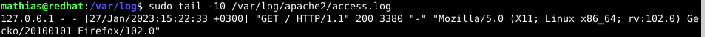
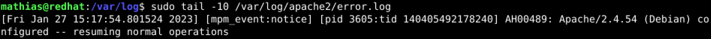
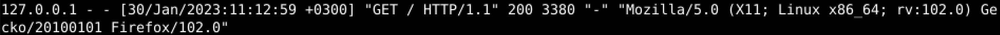
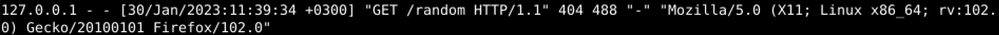

# LinuxPalvelimet-h4-Tukki!

## Mathias Helminen

## Rauta
    Mallin nimi:            MacBook Pro (Retina, 15-inch, Early 2013)
    Prosessorin nimi:       Quad-Core Intel Core i7
    Prosessorin nopeus:     2,7GHz
    Prosessorien määrä:     1
    Ydinten kokonaismäärä:  4
    Muisti (RAM):           16 Gt 1600 MHz DDR3
    Tallennustila:          500 Gt
    Näytönohjain:           Intel HD Graphics 4000
    Järjestelmän versio:    macOS Catalina 10.15.7
    Kernel-versio:          Darwin 19.6.0
    Virtuaalikone:          Oracle VirtualBox, Version 6.1.40
    

## x) Lue ja tiivistä
### Awesome macOS Command Line
Artikkeli kertoo ja listaa tärkeimmät komentorivikomennot macOS:lle

## a) Tukki - Analysoi yksi esimerkkirivi kustakin lokista

- /var/log/syslog

Ensin näkyy päivämäärä, sitten tietokoneen nimi, tämän jälkeen ohjelman nimi (ja prosessin tunnistenumero?) ja viimeisenä näkyy, mitä ohjelma tekee. Anacron on aikataulutusohjelma ja tämä loki kertoo, että cron.daily on käynnistynyt. En löytänyt nopealla googlauksella tarkoittaako [4307] anacronin perässä prosessin tunnistenumeroa.

- /var/log/auth.log

Ensin näkyy päivämäärä, sitten tietokoneen nimi ja root-oikeudet(sudo), tämän jälkeen käyttäjän nimi sekä mitä on tehty ja millä oikeuksilla.Yllä oleva kuva näyttää, että olen sudo-oikeuksilla avannut ``/var/log/auth.log`` lokin.

- /var/log/apache2/access.log

Avasin lokin komennolla ``sudo tail -10 /var/log/apache2/access.log``. Ensimmäisenä näkyy Apachen ip-osoite. Sitten päivämäärä. Sen jälkeen kerrotaan, mitä on tehty ja onko se onnistunut. Tämän jälkeen selain sekä käyttöjärjestelmä. Tämä on Apache HTTP serverin luoma lokitiedosto, joka käsittelee kaikki apache serverin kutsut. Tämä lokirivi muodostui kun kävin Mozilla Firefoxin kautta apachen http serverillä. Tämä oli onnistunut toimenpide ja luku "200" yllä olevassa kuvassa kertoo sen. En ollut varma mitä "Gecko" tarkoitti.

- /var/log/apache2/error.log

Avasin lokin komennolla ``sudo tail -10 /var/log/apache2/error.log``. Ensimmäisenä näkyy päivämäärä. En ole varma mitä mpm_event tekee. Prosessin tunnistenumero on 3605. Seuraavaksi näkyy kernelin thread identifier numero. Sen jälkeen näkyy Apache ja sen versionumero sekä käyttöjärjestelmä. Konfiguroitu. Lopussa lukee, että normaalia toimintaa on jatkettu.

## b) Aiheuta lokiin kaksi eri tapahtumaa ja analysoi rivit yksityiskohtaisesti

1. Onnistunut toimenpide

Avasin Mozilla -selaimen ja kirjoitin hakukenttään "localhost". Tämän jälkeen menin linuxin komentoriville ja kirjoitin seuraavan komennon ``sudo tail -10 /var/log/apache2/access.log``. Ensimmäisenä näkyy Apachen ip-osoite. Sitten päivämäärä. Sen jälkeen kerrotaan, mitä on tehty ja onko se onnistunut. Tämän jälkeen selain sekä käyttöjärjestelmä. Tämä on Apache HTTP serverin luoma lokitiedosto, joka käsittelee kaikki apache serverin kutsut. Tämä lokirivi muodostui kun kävin Mozilla Firefoxin kautta apachen http serverillä. Tämä oli onnistunut toimenpide ja luku "200" yllä olevassa kuvassa kertoo sen. En ollut vieläkään varma mitä "Gecko" tarkoitti.

2. Epäonnistunut toimenpide

Avasin Mozilla -selaimen ja kirjoitin url-hakukenttään "localhost/random". Selaimeen tuli teksti "404 Not Found". Tämän jälkeen menin linuxin komentoriville ja kirjoitin seuraavan komennon ``sudo tail -10 /var/log/apache2/access.log``. Printattu teksti on melkein sama kuin edellisessä tehtävässä, ainoa ero on numero "404 488". "HTTP 404 Not Found" tarkoittaa, että serveri ei löytänyt pyydettyä resurssia. 

## Lähteet

https://terokarvinen.com/2023/linux-palvelimet-2023-alkukevat/

https://hn.algolia.com/?dateEnd=1643270199&dateRange=custom&dateStart=1547942400&page=0&prefix=false&query=command%20line&sort=byPopularity&type=story

https://www.ionos.com/digitalguide/websites/website-creation/what-does-the-404-not-found-error-mean/
