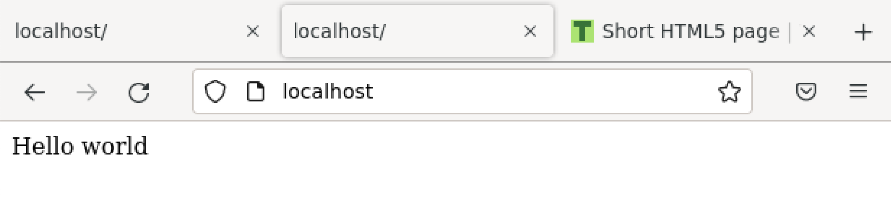
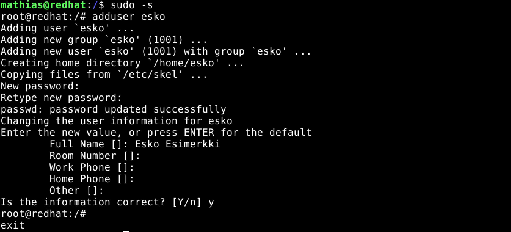
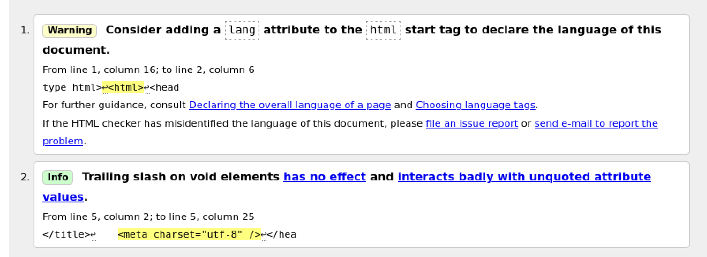

# LinuxPalvelimet-h5-HelloWeb!

## Mathias Helminen

## Rauta
    Mallin nimi:            MacBook Pro (Retina, 15-inch, Early 2013)
    Prosessorin nimi:       Quad-Core Intel Core i7
    Prosessorin nopeus:     2,7GHz
    Prosessorien määrä:     1
    Ydinten kokonaismäärä:  4
    Muisti (RAM):           16 Gt 1600 MHz DDR3
    Tallennustila:          500 Gt
    Näytönohjain:           Intel HD Graphics 4000
    Järjestelmän versio:    macOS Catalina 10.15.7
    Kernel-versio:          Darwin 19.6.0
    Virtuaalikone:          Oracle VirtualBox, Version 6.1.40
    
## Kuuntele ja tiivistä

## a) Apachen esimerkkisivun vaihtaminen

Tässä tehtävässä käytin komentoa ``echo "Hello World"|sudo tee /var/www/html/index.html``. Edellinen komento vaihtoi esimerkkisivulle tekstin "Hello World". Toiminto edellytti pääkäyttäjän oikeuksia.

## b) Laita käyttäjän kotisivu toimimaan

## c) Tee uusi käyttäjä

## d) Tee validi HTML sivu

## Lähteet
https://www.indiehackers.com/podcasts

https://linuxhint.com/add-user-linux-2/
