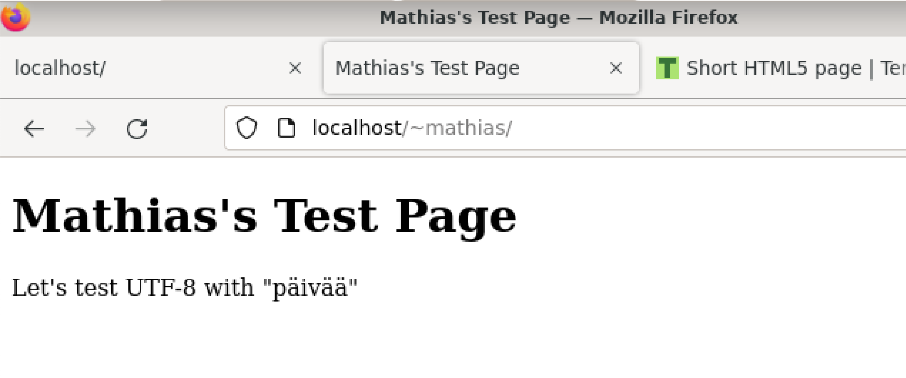
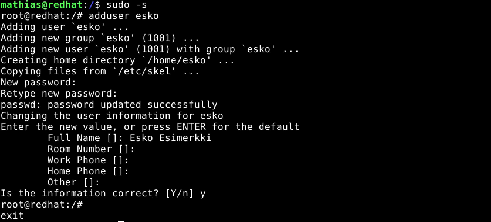

# LinuxPalvelimet-h5-HelloWeb!

## Mathias Helminen

## Rauta
    Mallin nimi:            MacBook Pro (Retina, 15-inch, Early 2013)
    Prosessorin nimi:       Quad-Core Intel Core i7
    Prosessorin nopeus:     2,7GHz
    Prosessorien määrä:     1
    Ydinten kokonaismäärä:  4
    Muisti (RAM):           16 Gt 1600 MHz DDR3
    Tallennustila:          500 Gt
    Näytönohjain:           Intel HD Graphics 4000
    Järjestelmän versio:    macOS Catalina 10.15.7
    Kernel-versio:          Darwin 19.6.0
    Virtuaalikone:          Oracle VirtualBox, Version 6.1.40
    
## Kuuntele ja tiivistä

x) Tätä tehtävää en kerkeä tekemään aikataulun mukaisesti, sillä valmistaudun huomenna torstaina olevaan työhaastatteluun. 

## a) Apachen esimerkkisivun vaihtaminen

Tässä tehtävässä käytin komentoa ``echo "Hello World"|sudo tee /var/www/html/index.html``. Edellinen komento vaihtoi esimerkkisivulle tekstin "Hello World". Toiminto edellytti pääkäyttäjän oikeuksia.

## b) Laita käyttäjän kotisivu toimimaan

Tässä tehtävässä muokkasin ``index.html`` tiedostoa komennolla ``nano index.html`` ja laitoin tiedoston sisälle lyhyen html koodin, jonka löysin Teron kotisivulta (https://terokarvinen.com/2012/short-html5-page/). Yllä olevassa kuvassa näkyy, miltä sivu näytti selaimessa.

    <!doctype html>
    <html>
    <head>
	<title>Mathias's Test Page</title>
	<meta charset="utf-8" />
    </head>
    <body>
	<h1>Mathias's Test Page</h1>
	
Let's test UTF-8 with "päivää"

    </body>
    </html>

## c) Tee uusi käyttäjä

Minulla oli vähän vaikeuksia tämän tehtävän kanssa, koska jostain syystä komento ``adduser`` ei toiminut. Nopean googlauksen jälkeen löysin ratkaisun, eli sudo oikeudet saadaan käyttöön komennolla ``sudo -s``. Tämä komento sai minut root-käyttäjäksi. Tämän jälkeen uuden käyttäjän tekeminen onnistui hyvin. Tein käyttäjän 'esko' koti-kansioon tiedoston ``public_html`` ja sen sisälle ``index.html`` tiedoston. Muokkasin ``index.html`` tiedostoa komennolla ``nano index.html`` ja kirjoitin tiedostoon "Moi, olen Esko!". Tämän jälkeen kokeilin, että näkyykö teksti Mozillassa oikein ja kyllä näkyi. 

## d) Tee validi HTML sivu

Tein tämän tehtävän puoliksi valmiiksi tehtävässä b. Lisäsin html koodia ja testasin sen selaimessa ja se näytti oikealta. Kuva tästä näkyy ylempänä tehtävässä b. Kun koodin sisältävä tiedosto ``index.html`` oli valmis, latasin sen https://validator.w3.org nettisivulle ja sain vastaukseksi yllä näkyvän kuvan. Ensimmäinen kohta sanoi, että koodiin pitäisi lisätä ``lang`` atribuutti. Toinen kohta ilmoitti ``/`` merkin käytöstä.

## Lähteet
https://www.indiehackers.com/podcasts

https://linuxhint.com/add-user-linux-2/

https://terokarvinen.com/2023/linux-palvelimet-2023-alkukevat/

https://terokarvinen.com/2012/short-html5-page/

https://validator.w3.org
