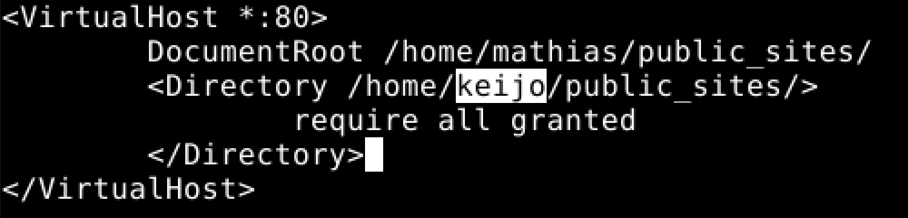

# LinuxPalvelimet-h5-HelloWeb!

## Mathias Helminen

## Rauta
    Mallin nimi:            MacBook Pro (Retina, 15-inch, Early 2013)
    Prosessorin nimi:       Quad-Core Intel Core i7
    Prosessorin nopeus:     2,7GHz
    Prosessorien määrä:     1
    Ydinten kokonaismäärä:  4
    Muisti (RAM):           16 Gt 1600 MHz DDR3
    Tallennustila:          500 Gt
    Näytönohjain:           Intel HD Graphics 4000
    Järjestelmän versio:    macOS Catalina 10.15.7
    Kernel-versio:          Darwin 19.6.0
    Virtuaalikone:          Oracle VirtualBox, Version 6.1.40
    
## x) Kuuntele ja tiivistä

Apache Software Foundation 2023: Getting Started
- asa
- gsgsg
- gsgsgs
- fafa

Apache Software Foundation 2023: Name-based Virtual Host Support
- cacaf
- fafsasf
- affaf

## a) Vaihda Apachelle uusi etusivu

Aloitin etusivun vaihtamisen komennolla ``sudoedit /etc/apache2/sites-available/frontpage.conf``. Edellinen komento avasi frontpage.conf tiedoston sudo oikeuksilla. Tämän jälkeen muokkasin tiedoston seuraavan näköiseksi tekstieditorilla:

Seuraavaksi suoritin komennon ``sudo a2ensite frontpage.conf``. Edellinen komento aktivoi kaikki kansion sivut.

Tämän jälkeen annoin komennon ``sudo a2dissite 000-default.conf``. Se kytki 000-default.conf -tiedoston pois päältä. 

Näiden muutosten jälkeen käynnistin Apachen uudelleen, jotta tehdyt muutokset astuivat voimaan. Käytin komentoa ``sudo systemctl restart apache2.service``.

Viimeiseksi tein ``public_sites`` nimisen kansion käyttäjän mathias kotikansioon ja lisäsin sinne ``index.html`` tiedoston. Testasin selaimessa toimiiko uusi etusivu ja se toimi.

## b) Tee Apachen asetustiedostoon kirjoitusvirhe

Ensimmäiseksi avasin Apachen asetukset komennolla ``sudoedit /etc/apache2/sites-available/frontpage.conf``. Tein kirjoitusvirheen kirjottamalla "keijo" tiedostopolkuun. Kyseistä "keijo" -nimistä käyttäjää ei oikeasti ole. Halusin nähdä millainen virheilmoitus tästä syntyy.

Tämän jälkeen käynnistin Apachen uudelleen, jotta muutos tulee voimaan. Käytin tähän seuraavaa komentoa ``sudo systemctl restart apache2.service``. 

Seuraavaksi kokeilin oliko etusivulle tullut muutoksia. Käytin tähän komentoa ``curl localhost``. Muutoksia oli tapahtunut, alla kuva.

Seuraavaksi käytin komentoja ``sudo tail -1 /var/log/apache2/error.log`` ja ``sudo /usr/sbin/apache2ctl configtest``. Kyseisillä komennoilla saadaan mahdolliset virheet näkyviin. Alla kuva virheilmoituksista.

Komennolla ``sudo tail -1 /var/log/apache2/error.log`` sain näkyviin tapahtuman virhelokin. Virhelokista silmiin osui [authz_core:error] sekä teksti "AH02630: client denied by server configuration: /home/mathias/public_sites". Tästä päättelin, että kyseessä on oikea virheilmoitus, joka johtuu väärin muotoillusta polusta.

Komento ``sudo /usr/sbin/apache2ctl configtest`` antoi seuraavan tekstin: "AH00558: apache2: Could not reliable determine the servers fully qualified domain name". Tämä virheilmoitus liittyi siis palvelimen domainiin.

## Lähteet

https://terokarvinen.com/2023/linux-palvelimet-2023-alkukevat/

https://httpd.apache.org/docs/2.4/getting-started.html

https://httpd.apache.org/docs/current/vhosts/name-based.html
