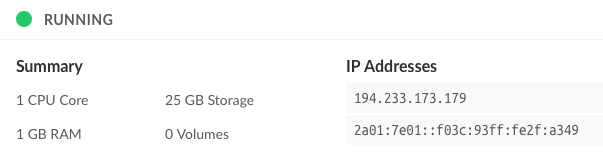

# LinuxPalvelimet-h7-Real_Internet

## Mathias Helminen

## Rauta
    Mallin nimi:            MacBook Pro (Retina, 15-inch, Early 2013)
    Prosessorin nimi:       Quad-Core Intel Core i7
    Prosessorin nopeus:     2,7GHz
    Prosessorien määrä:     1
    Ydinten kokonaismäärä:  4
    Muisti (RAM):           16 Gt 1600 MHz DDR3
    Tallennustila:          500 Gt
    Näytönohjain:           Intel HD Graphics 4000
    Järjestelmän versio:    macOS Catalina 10.15.7
    Kernel-versio:          Darwin 19.6.0
    Virtuaalikone:          Oracle VirtualBox, Version 6.1.40
    
## x) Lue ja tiivistä

Karvinen 2012: First Steps on a New Virtual Private Server – an Example on DigitalOcean and Ubuntu 16.04 LTS
- sadfasf
- asdfsaf
- asff
- asddfs
- sddsf

## a)

Vuokrasin virtuaalipalvelimen Linode.com sivulta. Operaatio oli helppo ja yksinkertainen. Alla kuva käynnissä olevasta virtuaalipalvelimestani.

## b)

Kun olin kirjautunut root-tunnuksilla virtuaalipalvelimelleni, tein seuraavat alkutoimet:

- Laitoin tulimuurin päälle

    $ sudo ufw allow 22/tcp
    $ sudo ufw enable

## c)

## d)

## Lähteet

https://terokarvinen.com/2017/09/19/first-steps-on-a-new-virtual-private-server-an-example-on-digitalocean/?fromSearch=first

https://terokarvinen.com/2023/linux-palvelimet-2023-alkukevat/

https://www.linode.com
