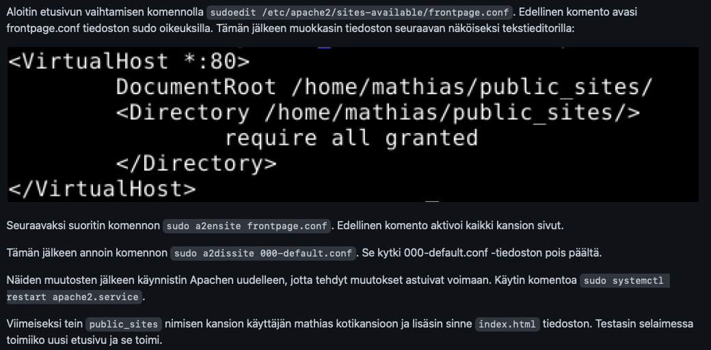
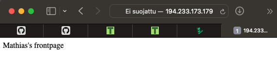
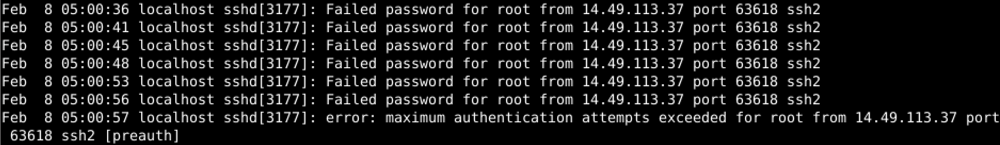

# LinuxPalvelimet-h7-Real_Internet

## Mathias Helminen

## Rauta
    Mallin nimi:            MacBook Pro (Retina, 15-inch, Early 2013)
    Prosessorin nimi:       Quad-Core Intel Core i7
    Prosessorin nopeus:     2,7GHz
    Prosessorien määrä:     1
    Ydinten kokonaismäärä:  4
    Muisti (RAM):           16 Gt 1600 MHz DDR3
    Tallennustila:          500 Gt
    Näytönohjain:           Intel HD Graphics 4000
    Järjestelmän versio:    macOS Catalina 10.15.7
    Kernel-versio:          Darwin 19.6.0
    Virtuaalikone:          Oracle VirtualBox, Version 6.1.40
    
## x) Lue ja tiivistä

Karvinen 2012: First Steps on a New Virtual Private Server – an Example on DigitalOcean and Ubuntu 16.04 LTS
- Artikkeli kertoo lyhyesti ja ytimekkäästi, kuinka virtuaalipalvelin asennetaan ja mitä pitäisi heti ensimmäiseksi tehdä
- Muista AINA käyttää hyviä salasanoja
- Seuraavat toimet pitäisi tehdä aina virtuaalipalvelimen hankinnan jälkeen:
1. Tee reikä tulimuuriin portille 22 ja ota tulimuuri käyttöön
2. Tee uusi käyttäjä ja anna sille sudo -oikeudet
3. Testaa toimiiko uuden käyttäjän sudo -oikeudet ja jos toimivat niin lukitse root-käyttäjän salasana
4. Päivitä uusimmat paketit, jotta vanhat tietoturva-aukot menevät kiinni
5. Asenna Apache ja tee palomuuriin uusi reikä portille 80, jotta saat yhteyden internetiin
6. Hanki itsellesi domain ja yhdistä se virtuaalipalvelimeen

## a) Vuokraa virtuaalipalvelin

Vuokrasin virtuaalipalvelimen Linode.com sivulta. Operaatio oli helppo ja yksinkertainen. Alla kuva käynnissä olevasta virtuaalipalvelimestani.

## b) Alkutoimet virtuaalipalvelimella

Kun olin kirjautunut root-tunnuksilla virtuaalipalvelimelleni, tein seuraavat alkutoimet:

- Laitoin tulimuurin päälle

    ``$ sudo ufw allow 22/tcp``
    
    ``$ sudo ufw enable``
    
- Latasin uusimmat päivitykset

    ``$ sudo apt-get update``
    
    ``$ sudo apt-get upgrade``

- Tein uuden käyttäjän

    ``$ sudo adduser mathias``
    
    ``$ sudo adduser mathias sudo``
    
    ``$ sudo adduser mathias adm``
    
    ``$ sudo adduset mathias admin``
    
- Lukitsin root-käyttäjän

    ``$ sudo usermod --lock root``
    
    ``$ sudoedit /etc/ssh/sshd_config``
    PermitRootLogin no
    
    ``$ sudo service ssh restart``
    
- Tein tulimuuriin reiän valmiiksi Apachelle

    ``$ sudo ufw allow 80/tcp``
    
Kokeilin jokaisen vaiheen jälkeen, että ne toimivat.

## c) Asenna Apache virtuaalipalvelimelle

Asensin Apachen virtuaalipalvelimelle täysin samalla tavalla kuin tehtävässä 6a). Alla kuva toteutuksesta.

Testasin sivun toimivuuden syöttämällä virtuaalipalvelimen IP-numeron selaimeen. Alla kuva miltä se näytti.

## d) Etsi merkkejä murtautumisyrityksistä

Menin ``/var/log/auth.log`` lokiin ja sieltä osui heti silmään muutamakin murtautumisyritys. Alla kuva yhdestä esimerkistä.

Kuvasta voi päätellä, että IP-osoite 14.49.113.37 on yrittänyt päästä virtuaalipalvelimelle arvaamalla salasanan kuusi kertaa väärin. Murtautuja on yrittänyt käyttää porttia 63618 ja ssh2 yhteyttä.

## Lähteet

https://terokarvinen.com/2017/09/19/first-steps-on-a-new-virtual-private-server-an-example-on-digitalocean/?fromSearch=first

https://terokarvinen.com/2023/linux-palvelimet-2023-alkukevat/

https://www.linode.com

https://github.com/mattehelmi/redhat/blob/main/LinuxPalvelimet-h6-Based.md
