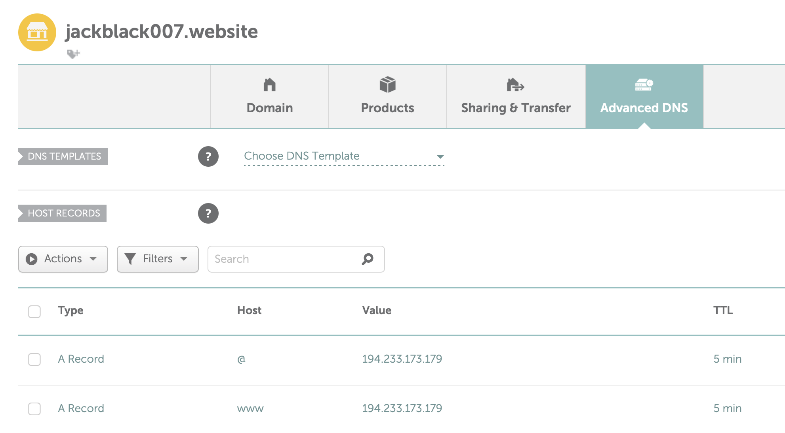
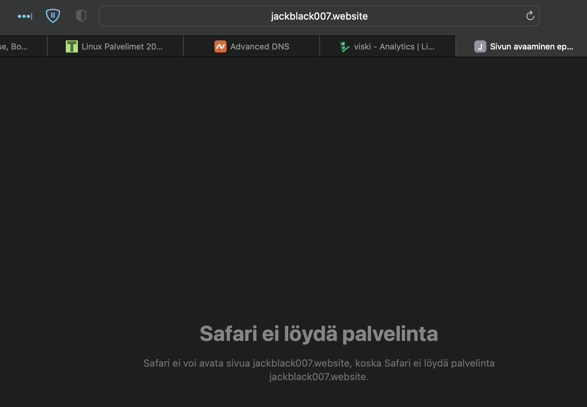
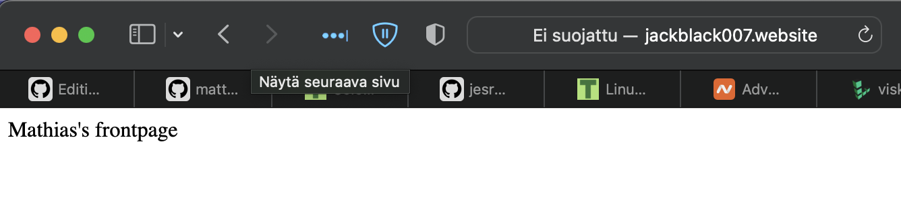
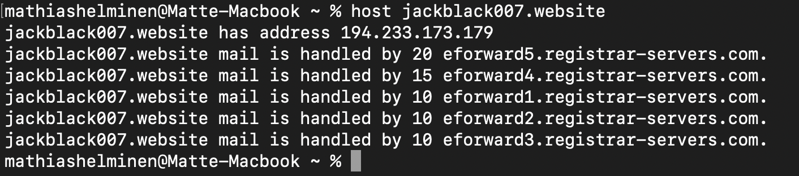
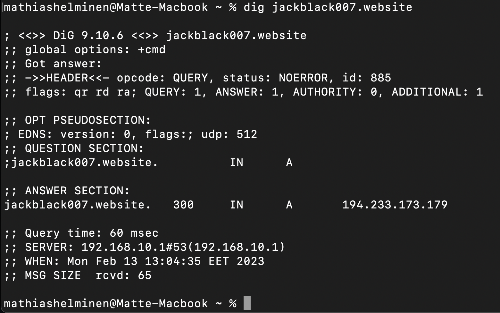

# LinuxPalvelimet-h8-Say-My-Name

## Mathias Helminen

## Rauta
    Mallin nimi:            MacBook Pro (Retina, 15-inch, Early 2013)
    Prosessorin nimi:       Quad-Core Intel Core i7
    Prosessorin nopeus:     2,7GHz
    Prosessorien määrä:     1
    Ydinten kokonaismäärä:  4
    Muisti (RAM):           16 Gt 1600 MHz DDR3
    Tallennustila:          500 Gt
    Näytönohjain:           Intel HD Graphics 4000
    Järjestelmän versio:    macOS Catalina 10.15.7
    Kernel-versio:          Darwin 19.6.0
    Virtuaalikone:          Oracle VirtualBox, Version 6.1.40
    
## a) Vuokraa domainnimi
Vuokrasin domainnimen NameCheapista. Minulla ei ole aikeissa ainakaan tällä hetkellä omistaa ns. oikeata domainia. Tästä syystä otin vuodeksi käyttöön ``jackblack007.website`` -domainin. Kyseinen domain maksoi ensimmäiseltä vuodelta 1,5€. Domainin vuokraaminen oli helppo operaatio, piti tehdä tunnus ja syöttää henkilökohtaiset tiedot. Sen jälkeen valittiin maksutapa ja itse valitsin Paypalin. Kun maksu oli suoritettu, niin vaihdoin oikeat DNS-asetukset. Alla kuva tekemistäni lisäyksistä DNS-asetuksiin. KLO 10:31
    

Kun olin päivittänyt DNS-asetukset, halusin kokeilla toimiiko uusi domain jo. Domain ei kuitenkaan toiminut eikä toimi vieläkään (KLO 11:13). Joten nyt vain odotan, että domain aktivoituu. Jätin tämän tehtävän maanataiaamuun, joten todennäköisesti domain ei ehdi aktivoitua 24h ennen läksyjen palautuksen takarajaa. Teen tehtävän loppuun kun domain aktivoituu. Alla kuva virheestä, joka tulee kun yritän avata ``jackblack007.website`` -sivun.

EDIT: Nyt domain toimii. KLO 12.40 Alla kuva domainista, joka on yhdistetty palvelimeeni.

    
## b) Tutki oman nimesi tietoja 'host' ja 'dig' -komennoilla
    
Teen tämän tehtävän kun domain aktivoituu.

EDIT: Domain toimii nyt. KLO 12:45

Tässä tehtävässä piti etsiä tietoa domainista käyttämällä komentoja ``host`` ja ``dig`` komentorivillä. Ensimmäiseksi kokeilin, mitä ``host jackblack007.website`` saa aikaan kun ajan komennon. Alla olevasta kuvasta huomaa, että komento näyttää domainiin yhdistetyn IP-osoitteen sekä erilaisia email edelleenlähetys palvelimia.

Komento ``dig jackblack007.website`` antoi alla näkyvän syötteen.

Ensimmäisessä kohdassa on ohjelman versionumero sekä komennon syöte. "Got answer" kertoo, miten palvelin vastasi komentoon. "Opt preudosection" kohdassa kerrotaan käytetyt liput (flags), käytetty protokolla (udp) sekä lisätietoa liittyen dns-asetuksiin (edns). "Question" ja "Answer" kohdat kertovat kysytyn sivun tietoja. Lopussa näkyy tietoa hausta: hakuaika millisekunteina, saadun datan koko ja dns-serverin IP-osoite.

## Lähteet

https://terokarvinen.com/2023/linux-palvelimet-2023-alkukevat/

https://www.namecheap.com
