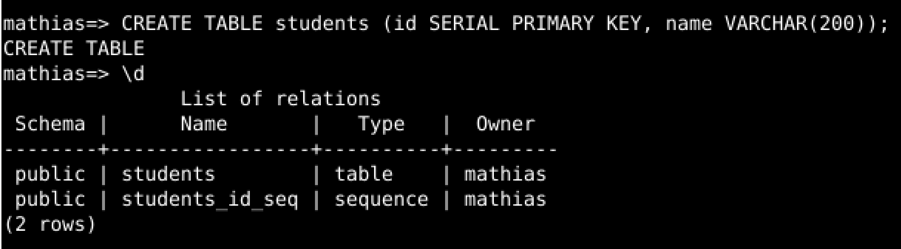
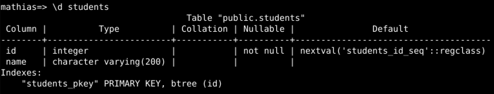
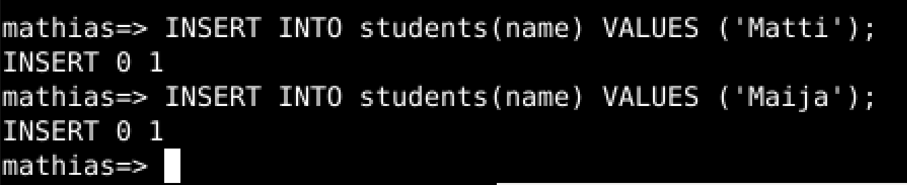
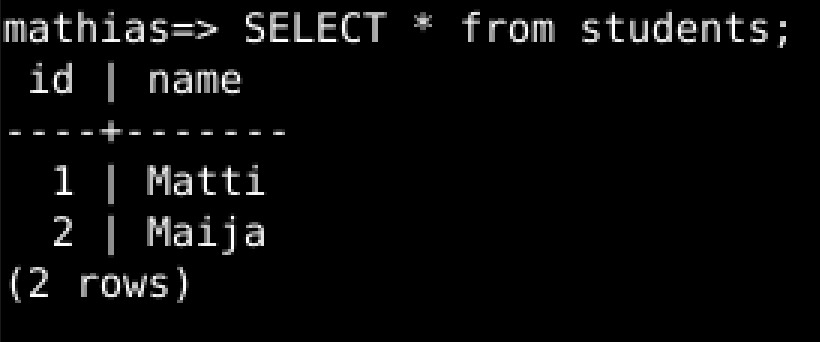
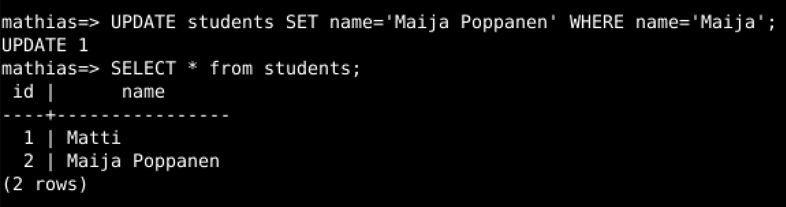
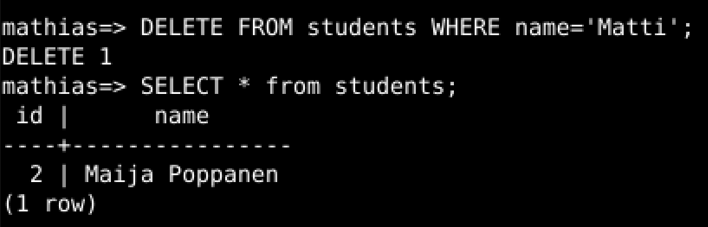

# LinuxPalvelimet-h9-Sequel

## Mathias Helminen

## Rauta
    Mallin nimi:            MacBook Pro (Retina, 15-inch, Early 2013)
    Prosessorin nimi:       Quad-Core Intel Core i7
    Prosessorin nopeus:     2,7GHz
    Prosessorien määrä:     1
    Ydinten kokonaismäärä:  4
    Muisti (RAM):           16 Gt 1600 MHz DDR3
    Tallennustila:          500 Gt
    Näytönohjain:           Intel HD Graphics 4000
    Järjestelmän versio:    macOS Catalina 10.15.7
    Kernel-versio:          Darwin 19.6.0
    Virtuaalikone:          Oracle VirtualBox, Version 6.1.40
    
## x) Esimerkki palvelusta, jota käytetään wepissä selaimella, koodi ajetaan palvelimella ja taustalla on tietokanta
Valitsin tähän esimerkiksi käyttämäni nettisivun Nimenhuuto.com. Se on palloilulajeihin suunnattu sivu, jossa ilmoittaudutaan esimerkiksi peleihin. Uskoisin, että kyseinen sivu käyttää kaikkia tehtävässä kuvattuja toimintoja, mutta en tosin ole tästä aivan 100 prosenttisen varma. Palvelussa on ainakin pakko olla tietokanta, sillä joukkueet ovat tallennettu sinne ja tietoja voidaan muokata. Minulla ei tule mieleen muuta tapaa toteuttaa palvelu, kuin käyttämällä tietokantoja.

- Nettisivulta löytyy käyttöliittymä, mutta esimerkiksi joukkueiden tiedot ovat haettu palvelimen avulla tietokannasta
- Nettiselain toimii suurin piirtein kaikilla mahdollisilla alustoilla eli sivulla on hyvä saavutettavuus
- Palvelimella tehdään sivulle muokkauksia, jotka sitten ladataan käyttäjälle kun hän esimerkiksi klikkaa toiminnallisuuksia sivulla

## a) Asenna PostgreSQL
Minulla ei ollut aikasempaa kokemusta PostgreSQL hallintajärjestelmästä. Asensin PostgreSQL:n alla näkyvillä komennoilla. KLO 14:25

``sudo apt-get update`` hakee uusimmat päivitykset.

``sudo apt-get -y install postgresql`` asentaa PostgreSQL:n ja vastaa tyhmiin kysymyksiin kyllä.

``sudo systemctl start postgresql`` käynnistää demonin.

``sudo -u postgres createdb mathias`` tekee mathias (sama nimi kuin virtuaalikoneen käyttäjä) nimisen tietokannan.

``sudo -u postgres createuser mathias`` luo mathias nimisen PostgreSQL käyttäjän.

Seuraavaksi kokeilin onnistuuko taulukon tekeminen PostgreSQL:ssä komennolla ``CREATE TABLE students (id SERIAL PRIMARY KEY, name VARCHAR(200));``. Edellinen komento tulosti halutun näköisen taulukon ja näytti sen komennolla ``\d`` ja tästä voidaan todeta, että PostgreSQL toimii ja asennus on ollut onnistunut. Alla vielä kuva taulukosta.

## b)CRUD
CRUD tulee sanoista create, read, update ja delete. Ensimmäiseksi siirryin PostgreSQL:ään komennolla ``psql``. Loin taulukon seuraavalla komennolla ``CREATE TABLE students (id SERIAL PRIMARY KEY, name VARCHAR(200));``. Käytin samaa komentoa kuin edellisessä tehtävässä. Komento ``\d`` tulosti taulukon. Alla vielä kuva taulukosta.

Seuraavaksi kokeilin saada näkyviin taulukon, joka kuvaa sen rakennetta. Tämä onnistui komennolla ``\d students``. Alla kuva.

Tämän jälkeen lisäsin taulukkoon seuraavat nimet: Matti ja Maija. Nimien lisäys tapahtui seuraavilla komennolla ``INSERT INTO students(name) VALUES ('Matti');`` ja ``INSERT INTO students(name) VALUES ('Maija');``. Alla kuva.

Seuraavaksi kokeilin lukea taulukkoa. Se onnistui komennolla ``SELECT * from students;``. Alla kuva.

Lukemisen jälkeen kokeilin päivittää taulukossa esiintyvän Maijan nimeä antamalla hänelle sukunimen "Poppanen". Tein sen seuraavalla komennolla ``UPDATE students SET name='Maija Poppanen' WHERE name='Maija';``. Nimen päivitys onnistui hyvin niin kuin alla olevasta kuvasta näkyy.

Viimeiseksi yritin poistaa Matti -nimen pois taulukosta. Tein sen komennolla ``DELETE FROM students WHERE name='Matti';``. Nimen poistaminen onnistui hyvin ja alla kuva taulukosta, jossa ei enää ole nimeä Matti.

## Lähteet

https://terokarvinen.com/2016/03/03/install-postgresql-on-ubuntu-new-user-and-database-in-3-commands/

https://terokarvinen.com/2023/linux-palvelimet-2023-alkukevat/

