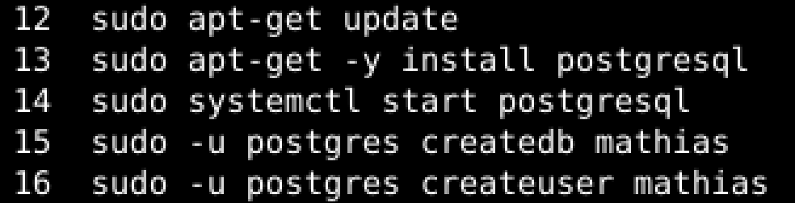

# LinuxPalvelimet-h9-Sequel

## Mathias Helminen

## Rauta
    Mallin nimi:            MacBook Pro (Retina, 15-inch, Early 2013)
    Prosessorin nimi:       Quad-Core Intel Core i7
    Prosessorin nopeus:     2,7GHz
    Prosessorien määrä:     1
    Ydinten kokonaismäärä:  4
    Muisti (RAM):           16 Gt 1600 MHz DDR3
    Tallennustila:          500 Gt
    Näytönohjain:           Intel HD Graphics 4000
    Järjestelmän versio:    macOS Catalina 10.15.7
    Kernel-versio:          Darwin 19.6.0
    Virtuaalikone:          Oracle VirtualBox, Version 6.1.40
    
## x) Esimerkki palvelusta, jota käytetään wepissä selaimella, koodi ajetaan palvelimella ja taustalla on tietokanta

## a) Asenna PostgreSQL
Minulla ei ollut aikasempaa kokemusta PostgreSQL hallintajärjestelmästä. Asensin PostgreSQL:n alla näkyvillä komennoilla.

``sudo apt-get update`` hakee uusimmat päivitykset.
``sudo apt-get -y install postgresql`` asentaa PostgreSQL:n ja vastaa tyhmiin kysymyksiin kyllä.
``sudo systemctl start postgresql`` käynnistää demonin.
``sudo -u postgres createdb mathias`` tekee mathias nimisen tietokannan
``sudo -u postgres createuser mathias`` luo mathias nimisen PostgreSQL käyttäjän

## b)CRUD

## Lähteet

https://terokarvinen.com/2016/03/03/install-postgresql-on-ubuntu-new-user-and-database-in-3-commands/

https://terokarvinen.com/2023/linux-palvelimet-2023-alkukevat/

